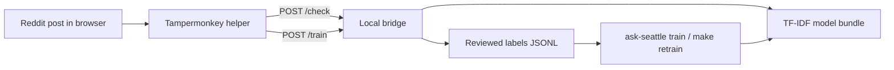

# Ask Seattle Classifier

Ask Seattle is a local, bridge-only classifier for Reddit submissions. It helps moderators or reviewers label posts as `askseattle` or `not_askseattle`, retrain a cheap local model from those reviewed labels, and check posts through a localhost bridge.

The current stack is intentionally small:

- browser-captured text only
- one TF-IDF + logistic regression model
- local JSONL training data
- no Reddit API reads
- no Reddit API writes
- no moderation actions built into the bridge

## What This Repo Does

- captures reviewed labels from a Tampermonkey userscript
- stores those labels locally under ignored paths
- retrains a local binary classifier from the reviewed label file
- serves a localhost `/check` endpoint for the userscript and local tooling

## What This Repo Does Not Do

- fetch Reddit posts server-side
- remove, approve, lock, reply to, or report Reddit posts
- host a production moderation bot
- train hosted or large-model classifiers

## How It Works



## Requirements

- Python 3.11+
- a browser with Tampermonkey
- either:
  - an existing trained model artifact, or
  - an existing reviewed label file you can retrain from

## Quickstart

```bash
python3 -m venv .venv
source .venv/bin/activate
python -m pip install --upgrade pip
python -m pip install -e ".[dev]"
```

Then choose the path that matches your current state.

### Start The Bridge With An Existing Model

```bash
make bridge
```

### Retrain From Reviewed Labels

```bash
make retrain
make bridge
```

If you want to train on mixed reviewed data but benchmark only on `/r/seattle`, use:

```bash
make retrain EVAL_SUBREDDIT=seattle
make bridge EVAL_SUBREDDIT=seattle
```

### Run A Benchmark Without Replacing The Bridge Model

```bash
make benchmark
```

This runs the same training and held-out evaluation path as `make retrain`, but writes artifacts to:

- `models/benchmark/`

That makes it useful when you want fresh metrics without immediately replacing the model bundle your bridge is using.

Use a target-subreddit benchmark like this:

```bash
make benchmark EVAL_SUBREDDIT=seattle
```

### Compare A Few Lightweight Variants On The Same Split

```bash
make benchmark-variants EVAL_SUBREDDIT=seattle
```

This writes side-by-side benchmark artifacts under:

- `models/benchmark-variants/`

The current comparison set is:

- legacy baseline
- extra stopwords only
- lower `char_wb` weight only
- recommended default

### Run A One-Off Local Check

```bash
ask-seattle check \
  --model models/real-labels-precision-refresh/tfidf_logreg.joblib \
  --title "Where should I stay for a weekend visit?" \
  --selftext "First time in Seattle and looking for hotel and food recommendations."
```

`serve-bridge` requires an existing `.joblib` artifact. On a clean checkout, you need either an existing model bundle or a reviewed label file you can train from.

## Normal Workflow

1. Start the bridge with a trained model.
2. Open Reddit with the Tampermonkey helper installed.
3. Use the helper to check and label posts.
4. Retrain from the reviewed label file.
5. Restart the bridge unless bridge auto-retrain is enabled.

The reviewed post text used for training must originate in the browser helper. There is no separate server-side collection path in the supported workflow.

## Core Behavior

- the userscript can auto-check, re-check, skip through a seeded queue, and save binary labels
- the bridge only accepts browser-originated text and local file paths
- `ask-seattle train` normalizes and dedupes the reviewed JSONL file, then performs chronological training, calibration, and test evaluation
- the default TF-IDF model keeps the conservative core stopword list and uses a lower `char_wb` weight than the legacy baseline
- training writes artifacts even when a run is not production-ready

For the detailed operator flow, see [How to label posts](docs/how-to/label-posts.md) and [How to retrain](docs/how-to/retrain.md).

## Local Storage

The project stores reviewed post text locally by design.

Canonical reviewed label file:

- `data/processed/tampermonkey_labels.jsonl`

Default model output directory:

- `models/real-labels-precision-refresh/`

## Common Commands

```bash
make retrain
make benchmark
make benchmark-variants EVAL_SUBREDDIT=seattle
make bridge
make bridge RETRAIN_EVERY=25
python3 -m ruff check src tests
PYTHONPATH=src python3 -m pytest
```

## Documentation

Start here:

- [Documentation home](docs/index.md)
- [Maintainer guidance](AGENTS.md)
- [Labeling policy](docs/labeling_policy.md)

How-to guides:

- [Label posts in the browser](docs/how-to/label-posts.md)
- [Retrain from reviewed labels](docs/how-to/retrain.md)
- [Troubleshoot common problems](docs/how-to/troubleshoot.md)

Reference:

- [CLI reference](docs/reference/cli.md)
- [Bridge API reference](docs/reference/bridge-api.md)
- [Reviewed data and artifacts reference](docs/reference/data-format.md)

Explanation:

- [Architecture](docs/architecture.md)
- [Model and thresholds](docs/explanation/model-and-thresholds.md)
- [Roadmap](docs/model_plan.md)

## Status And Limitations

- binary classifier only: `askseattle` vs `not_askseattle`
- optimized for local use, not shared deployment
- browser-dependent capture
- no automatic moderation actions
- quality depends heavily on reviewed labels and time coverage

Future moderation tools should sit on top of `/check`, not inside the bridge.
