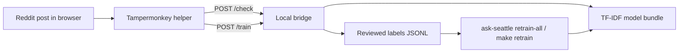

# Ask Seattle Classifier

Ask Seattle is a local, bridge-only classifier for Reddit submissions. It helps moderators or reviewers label posts as `askseattle` or `not_askseattle`, retrain a cheap local model from those reviewed labels, and check posts through a localhost bridge.

The current stack is intentionally small:

- browser-captured text only
- one TF-IDF + logistic regression operational model
- one local six-model benchmark suite for comparison work
- local JSONL training data
- optional remote RunPod Pod execution for the existing train and benchmark targets
- optional remote Windows WSL execution for the existing train and benchmark targets
- no Reddit API reads
- no Reddit API writes
- no moderation actions built into the bridge

## What This Repo Does

- captures reviewed labels from a Tampermonkey userscript
- stores those labels locally under ignored paths
- retrains a local binary classifier from the reviewed label file
- serves a localhost `/check` endpoint for the userscript and local tooling

## What This Repo Does Not Do

- fetch Reddit posts server-side
- remove, approve, lock, reply to, or report Reddit posts
- host a production moderation bot
- require hosted model services

## How It Works



## Requirements

- Python 3.11+
- a browser with Tampermonkey
- either:
  - an existing trained model artifact, or
  - an existing reviewed label file you can retrain from

## Quickstart

```bash
python3 -m venv .venv
source .venv/bin/activate
python -m pip install --upgrade pip
python -m pip install -e ".[dev]"
```

If you want to run the full six-model benchmark suite, install the optional model dependencies too:

```bash
python -m pip install -e ".[dev,models]"
```

Then choose the path that matches your current state.

### Start The Bridge With An Existing Model

```bash
make bridge
```

### Retrain From Reviewed Labels

```bash
make retrain
```

That retrains:

- the operational TF-IDF model under `models/real-labels-precision-refresh/`
- all six suite models under `models/benchmark-suite/`

It does not run held-out benchmarks.

If you want to train on mixed reviewed data but keep `/r/seattle` as the evaluation domain for later benchmarks, use:

```bash
make retrain EVAL_SUBREDDIT=seattle
```

Then benchmark and restart the bridge:

```bash
make benchmark EVAL_SUBREDDIT=seattle
make bridge EVAL_SUBREDDIT=seattle
```

### Run Benchmarks On Trained Models

```bash
make benchmark
```

This benchmarks the trained suite models already under:

- `models/benchmark-suite/`

It does not retrain them. If a model is missing or stale for the current `suite_input.json`, the benchmark logs a warning and skips it.

Use a target-subreddit benchmark like this:

```bash
make benchmark EVAL_SUBREDDIT=seattle
```

You can attach a note to the archived benchmark record:

```bash
make benchmark EVAL_SUBREDDIT=seattle BENCHMARK_NOTES="after adding april labels"
```

### Compare A Few Lightweight Variants On The Same Split

```bash
make benchmark-variants EVAL_SUBREDDIT=seattle
```

This writes side-by-side benchmark artifacts under:

- `models/benchmark-variants/`

The current comparison set is:

- legacy baseline
- recommended default
- TF-IDF tuning grid over:
  - `C`
  - `char_weight`
  - `metadata_weight`
  - `min_df`

### Compare The Full Benchmark Suite

```bash
make benchmark-suite EVAL_SUBREDDIT=seattle
```

`make benchmark-suite` is now an alias for `make benchmark`.

The suite artifacts live under:

- `models/benchmark-suite/`

Each benchmark run now also archives:

- the latest `benchmark_suite_summary.json`
- an append-only `benchmark_history.json` index
- one immutable history snapshot under `models/benchmark-suite/history/<run_id>/`

The suite currently compares six models on one shared split:

- `tfidf_recommended`
- `semantic_minilm_tuned`
- `semantic_qwen3_embedding_0_6b`
- `transformer_deberta_v3_small`
- `transformer_modernbert_base`
- `causal_lm_qwen3_1_7b_lora`

If the benchmark suite artifacts exist, `make bridge` also loads those comparison models for side-by-side `/check` comparisons in the userscript UI.

If you want the preferred remote training path, use RunPod:

```bash
make runpod-bootstrap
make retrain REMOTE=runpod EVAL_SUBREDDIT=seattle
make benchmark REMOTE=runpod EVAL_SUBREDDIT=seattle
```

The default RunPod settings are now reliability-first and cost-biased:

1. official template `runpod-torch-v240`
2. GPU preference:
   - `NVIDIA RTX A5000`
   - `NVIDIA GeForce RTX 4090`
   - `NVIDIA A40`
3. datacenter preference:
   - `EU-RO-1`
   - `US-NC-1`
   - `US-KS-2`
   - `US-IL-1`
   - `US-GA-2`

The RunPod helper now also performs a hard GPU smoke test before syncing labels or starting training, so it fails fast if CUDA is not actually usable inside the pod.

If you want to avoid cloud spend entirely, use a separate Windows 11 GPU box over SSH via WSL:

```bash
make retrain REMOTE=wsl REMOTE_WSL_HOST=gpu-win EVAL_SUBREDDIT=seattle
make benchmark REMOTE=wsl REMOTE_WSL_HOST=gpu-win EVAL_SUBREDDIT=seattle
```

That Make path is a wrapper around the existing WSL helper and is the recommended price-first remote option when you have your own 4090-class machine.

You can still call the helper directly if you want:

```bash
scripts/run_remote_training.sh --host gpu-win --target benchmark-suite
```

See [How to run training on a remote Windows WSL box](docs/how-to/remote-wsl-training.md).

Both remote paths now apply a generous default remote execution timeout of 6 hours. Override it with `REMOTE_RUN_TIMEOUT=<seconds>` if needed.

See [How to run training on RunPod](docs/how-to/runpod-training.md).

### Run A One-Off Local Check

```bash
ask-seattle check \
  --model models/real-labels-precision-refresh/tfidf_logreg.joblib \
  --title "Where should I stay for a weekend visit?" \
  --selftext "First time in Seattle and looking for hotel and food recommendations."
```

`serve-bridge` requires an existing `.joblib` artifact. On a clean checkout, you need either an existing model bundle or a reviewed label file you can train from.

## Normal Workflow

1. Start the bridge with a trained model.
2. Open Reddit with the Tampermonkey helper installed.
3. Use the helper to check and label posts.
4. Retrain from the reviewed label file.
5. Benchmark the trained suite when you want fresh comparison metrics.
6. Restart the bridge unless bridge auto-retrain is enabled.

The reviewed post text used for training must originate in the browser helper. There is no separate server-side collection path in the supported workflow.

The public GitHub repo is code and docs only. Reviewed labels and any other training corpus material stay local to each contributor and are only synced to remote training machines per run.

## Core Behavior

- the userscript can auto-check, re-check, skip through a seeded queue, and save binary labels
- when benchmark-suite artifacts exist, the userscript also shows six side-by-side model result cards for the current post
- the userscript now gets the main bridge verdict first, then fills in each comparison card as that model finishes instead of waiting for all six models before updating the panel
- the bridge only accepts browser-originated text and local file paths
- `ask-seattle train` normalizes and dedupes the reviewed JSONL file, then performs a deterministic random train, calibration, and test split by default
- `ask-seattle retrain-all` retrains the operational TF-IDF model plus all six suite models without running held-out benchmarks
- `ask-seattle benchmark-suite` reads those trained suite artifacts later and computes held-out metrics only for models that are already trained for the current manifest
- the same split object is reused across all six benchmark evaluators so comparisons are apples-to-apples
- if you later want future-facing evaluation on a longer collection window, you can opt into `SPLIT_STRATEGY=time`
- the shared model text now includes normalized content metadata when available, such as post type, content domain, crosspost status, and whether the post has body text
- the shared model text also includes light structural cues such as title/body length buckets, question-mark presence, and a sparse-media marker for image/link posts with very little text
- the default TF-IDF model keeps metadata in its own exact-token feature channel, so character n-grams only see natural title/body text instead of synthetic markers like `HAS_QUESTION_MARK:yes`
- the default TF-IDF model also normalizes raw URLs in lexical channels to a neutral `URL` token, so transport syntax like `https` or `://` does not dominate the word and character features while domain/post-type signal stays available in metadata
- the default TF-IDF word stopword list now also excludes `just`, `one`, and `some`, which benchmarked better than leaving them active on the current `/r/seattle` split
- the default TF-IDF model also scales `min_df` upward as the corpus grows so low-support phrases do not dominate once the label set is larger
- the TF-IDF review threshold now uses a looser review-queue target than the strict auto bucket, so review recall does not collapse on the latest label snapshots
- the training harness now reports cohort coverage and applies conservative slice-aware positive weighting, but only `image` and `low_text` remain active tuning levers
- `ask-seattle retrain-all` writes the shared `suite_input.json` manifest plus six training-only suite summaries, and `ask-seattle benchmark-suite` adds held-out metrics later
- rerunning `retrain-all` now resumes from compatible completed model artifacts for the same manifest, so a later failure does not force the whole suite to start over
- benchmark summaries are written separately from training-only suite summaries, so retrain and benchmark are now two explicit steps
- each benchmark run now records notes, a human-readable benchmark representation, and an immutable history snapshot so you can compare results over time
- the benchmark summaries now include threshold-independent comparison metrics such as `pr_auc`, `auto_recall_at_precision_95`, and `review_recall_at_precision_75`
- slice metrics now include support counts and `support_status`, so low-support cohorts like `sparse_media` can stay observational instead of steering recommendations
- the semantic family now includes a tuned MiniLM path and a Qwen3 embedding path, both using split title/body embeddings plus a metadata one-hot block before the calibrated logistic-regression head
- the transformer family now includes DeBERTa-v3-small and ModernBERT-base
- the decoder-LLM family uses Qwen3-1.7B with local LoRA fine-tuning and two-label continuation scoring
- the decoder-LLM prompt now uses a compact contextual English template with title, body, post type, content domain, question-mark state, low-text state, and crosspost state
- on Apple Silicon, the Qwen3-1.7B benchmark path bypasses MPS and trains on CPU by default because the current MPS stack is not stable for that family
- on Apple Silicon, the Qwen3 embedding benchmark path also bypasses MPS and uses CPU during training because the current Metal backend is not stable for that model family
- on Apple Silicon, the bridge also keeps the Qwen-based comparison models off MPS during `/check`, so those comparisons stay stable even if they are slower
- the bridge now returns the primary `/check` result without waiting for comparison models unless explicitly asked to include them, and the userscript loads comparison cards individually through `/check-comparison`
- the encoder transformer benchmarks now compare plain vs balanced cross-entropy, stop early on calibration PR-AUC, and keep the better candidate
- all benchmark summaries now include the same operating metrics for:
  - the strict `high` bucket
  - the broader `low-or-higher` review queue
  - queue size and queue rate
- benchmark summaries now also break performance out by:
  - post type
  - low-text vs richer-text posts
  - sparse-media vs non-sparse-media posts
- `production_ready` now also requires a minimum number of held-out `high` bucket predictions, so a model does not clear the gate on one or two easy test examples
- training writes artifacts even when a run is not production-ready

For the detailed operator flow, see [How to label posts](docs/how-to/label-posts.md) and [How to retrain](docs/how-to/retrain.md).

## Local Storage

The project stores reviewed post text locally by design.

Canonical reviewed label file:

- `data/processed/tampermonkey_labels.jsonl`

Default model output directory:

- `models/real-labels-precision-refresh/`

## Common Commands

```bash
make retrain
make benchmark
make benchmark-variants EVAL_SUBREDDIT=seattle
make benchmark-suite EVAL_SUBREDDIT=seattle
make bridge
make bridge RETRAIN_EVERY=25
make benchmark EVAL_SUBREDDIT=seattle SPLIT_STRATEGY=time
python3 -m ruff check src tests
PYTHONPATH=src python3 -m pytest
```

## Documentation

Start here:

- [Documentation home](docs/index.md)
- [Maintainer guidance](AGENTS.md)
- [Labeling policy](docs/labeling_policy.md)

How-to guides:

- [Label posts in the browser](docs/how-to/label-posts.md)
- [Retrain from reviewed labels](docs/how-to/retrain.md)
- [Run training on a remote Windows WSL box](docs/how-to/remote-wsl-training.md)
- [Troubleshoot common problems](docs/how-to/troubleshoot.md)

Reference:

- [CLI reference](docs/reference/cli.md)
- [Bridge API reference](docs/reference/bridge-api.md)
- [Reviewed data and artifacts reference](docs/reference/data-format.md)

Explanation:

- [Architecture](docs/architecture.md)
- [Model and thresholds](docs/explanation/model-and-thresholds.md)
- [Roadmap](docs/model_plan.md)

## Status And Limitations

- binary classifier only: `askseattle` vs `not_askseattle`
- optimized for local use, not shared deployment
- browser-dependent capture
- no automatic moderation actions
- quality depends heavily on reviewed labels and time coverage

Future moderation tools should sit on top of `/check`, not inside the bridge.
