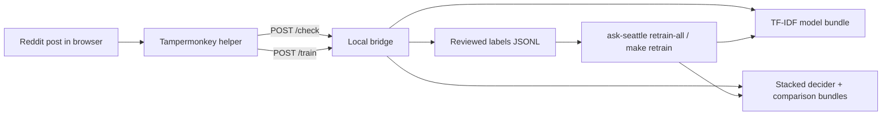

# Ask Seattle Classifier

Ask Seattle is a local, bridge-only classifier for Reddit submissions. It helps moderators or reviewers label posts as `askseattle` or `not_askseattle`, retrain a cheap local model from those reviewed labels, and check posts through a localhost bridge.

The current stack is intentionally small:

- browser-captured text only
- one TF-IDF + logistic regression operational retrain path
- one default stacked transformer bridge decider when suite artifacts exist
- one optional bridge-side hybrid decider for routed comparison work
- one local five-model benchmark suite for comparison work
- local JSONL training data
- optional remote RunPod Pod execution for the existing train and benchmark targets
- optional remote Windows WSL execution for the existing train and benchmark targets
- no Reddit API reads
- no Reddit API writes
- no moderation actions built into the bridge

## What This Repo Does

- captures reviewed labels from a Tampermonkey userscript
- stores those labels locally under ignored paths
- retrains a local binary classifier from the reviewed label file
- serves a localhost `/check` endpoint for the userscript and local tooling

## What This Repo Does Not Do

- fetch Reddit posts server-side
- remove, approve, lock, reply to, or report Reddit posts
- host a production moderation bot
- require hosted model services

## How It Works



## Requirements

- Python 3.11+
- a browser with Tampermonkey
- either:
  - an existing trained model artifact, or
  - an existing reviewed label file you can retrain from

## Quickstart

```bash
python3 -m venv .venv
source .venv/bin/activate
python -m pip install --upgrade pip
python -m pip install -e ".[dev]"
```

If you want to run the full transformer-backed benchmark suite, install the optional model dependencies too:

```bash
python -m pip install -e ".[dev,models]"
```

Then choose the path that matches your current state.

### Start The Bridge With An Existing Model

```bash
make bridge
```

### Retrain From Reviewed Labels

```bash
make retrain
```

That retrains:

- the operational TF-IDF model under `models/real-labels-precision-refresh/`
- the five-model comparison suite under `models/benchmark-suite/`

It does not run held-out benchmarks.

If you want to train on mixed reviewed data but keep `/r/seattle` as the evaluation domain for later benchmarks, use:

```bash
make retrain EVAL_SUBREDDIT=seattle
```

Then benchmark and restart the bridge:

```bash
make benchmark EVAL_SUBREDDIT=seattle
make bridge EVAL_SUBREDDIT=seattle
```

The RunPod path keeps a 3-day retained cache volume by default. That volume now reuses the remote checkout, virtualenv, and model/download caches directly unless the dependency environment key changes or the cached venv fails a health check.

### Run Benchmarks On Trained Models

```bash
make benchmark
```

This benchmarks the trained suite models already under:

- `models/benchmark-suite/`

It does not retrain them. If a model is missing or stale for the current `suite_input.json`, the benchmark logs a warning and skips it.

Use a target-subreddit benchmark like this:

```bash
make benchmark EVAL_SUBREDDIT=seattle
```

You can attach a note to the archived benchmark record:

```bash
make benchmark EVAL_SUBREDDIT=seattle BENCHMARK_NOTES="after adding april labels"
```

### Compare A Few Lightweight Variants On The Same Split

```bash
make benchmark-variants EVAL_SUBREDDIT=seattle
```

This writes side-by-side benchmark artifacts under:

- `models/benchmark-variants/`

The current comparison set is:

- legacy baseline
- recommended default
- TF-IDF tuning grid over:
  - `C`
  - `char_weight`
  - `metadata_weight`
  - `min_df`
  - `max_slice_positive_weight`

If `models/benchmark-suite/suite_input.json` already exists, the variants command reuses that exact suite manifest so TF-IDF sweeps stay directly comparable to the latest full-suite run.

### Run A Selected-Model Seed Sweep

```bash
make benchmark-seed-sweep EVAL_SUBREDDIT=seattle
```

This retrains and benchmarks the current top neural comparison models across multiple deterministic split seeds without changing the normal `make retrain` / `make benchmark` flow.

By default it evaluates:

- `transformer_modernbert_base`
- `transformer_neobert`
- `transformer_modernbert_large`

and writes:

- `models/benchmark-suite/seed_sweeps/seed_sweep_summary.json`

### Compare The Full Benchmark Suite

```bash
make benchmark-suite EVAL_SUBREDDIT=seattle
```

`make benchmark-suite` is now an alias for `make benchmark`.

The suite artifacts live under:

- `models/benchmark-suite/`

Each benchmark run now also archives:

- the latest `benchmark_suite_summary.json`
- an append-only `benchmark_history.json` index
- one immutable history snapshot under `models/benchmark-suite/history/<run_id>/`

The suite currently compares five artifact-backed models on one shared split:

- `tfidf_recommended`
- `transformer_modernbert_base`
- `transformer_neobert`
- `transformer_modernbert_large`
- `stacked_transformer_decider`

When TF-IDF plus at least two comparison models benchmark successfully for the current manifest, the suite summary also adds one derived `hybrid_consensus_policy` row. That row reports the optional routed hybrid bridge policy on the same held-out split, not a separately trained artifact.

The stacked transformer decider is now trained from out-of-fold component scores, not in-sample transformer predictions. That means the second-stage logistic model learns from honest held-out transformer probabilities on the suite train split, then calibrates and thresholds itself on the normal suite calibration split.

If the benchmark suite artifacts exist, `make bridge` also loads those comparison models for side-by-side `/check` comparisons in the userscript UI.

If you want the preferred remote training path, use RunPod:

```bash
make runpod-bootstrap
make retrain REMOTE=runpod EVAL_SUBREDDIT=seattle
make benchmark REMOTE=runpod EVAL_SUBREDDIT=seattle
```

The default RunPod settings are now reliability-first and VRAM-biased:

1. official template `runpod-torch-v240`
2. GPU preference:
   - `NVIDIA RTX A6000`
   - `NVIDIA RTX 6000 Ada Generation`
   - `NVIDIA L40S`
   - `NVIDIA GeForce RTX 4090`
3. datacenter preference:
   - `EU-RO-1`
   - `US-NC-1`
   - `US-KS-2`
   - `US-IL-1`
   - `US-GA-2`

The RunPod helper now prefers 48 GB cards first because they materially reduce long-context training failures while staying in a reasonable on-demand price band, and it keeps the `4090` in the primary set for faster allocation when those higher-VRAM cards are not available. The helper also performs a hard GPU smoke test before syncing labels or starting training, so it fails fast if CUDA is not actually usable inside the pod.
Successful RunPod cache volumes are now retained for 3 days by default so the next run can reuse the checkout, virtualenv, and model caches, but pods are still deleted at the end of every run. Expired retained volumes are no longer deleted opportunistically before reuse; instead, prune them explicitly with `make runpod-prune-volumes` or schedule that target locally on your Mac.
If a retained cache volume gets pinned to a region that no longer has your preferred GPU, the helper now tries a bounded same-datacenter fallback GPU list before giving up. If none of those GPUs can be allocated, it preserves the cache by default and fails clearly. Opt into relocation with `RUNPOD_EVICT_VOLUME_ON_CAPACITY_FAILURE=1`, or delete the cache explicitly with `make runpod-cleanup`.
Pod creation now uses the official RunPod REST API directly, with `runpodctl` left in place for the simpler discovery, SSH, volume, and cleanup operations.

If you want to avoid cloud spend entirely, use a separate Windows 11 GPU box over SSH via WSL:

```bash
make retrain REMOTE=wsl REMOTE_WSL_HOST=gpu-win EVAL_SUBREDDIT=seattle
make benchmark REMOTE=wsl REMOTE_WSL_HOST=gpu-win EVAL_SUBREDDIT=seattle
```

That Make path is a wrapper around the existing WSL helper and is the recommended price-first remote option when you have your own 4090-class machine.

You can still call the helper directly if you want:

```bash
scripts/run_remote_training.sh --host gpu-win --target benchmark-suite
```

See [How to run training on a remote Windows WSL box](docs/how-to/remote-wsl-training.md).

Both remote paths now apply a generous default remote execution timeout of 6 hours. Override it with `REMOTE_RUN_TIMEOUT=<seconds>` if needed.

See [How to run training on RunPod](docs/how-to/runpod-training.md).

### Run A One-Off Local Check

```bash
ask-seattle check \
  --model models/real-labels-precision-refresh/tfidf_logreg.joblib \
  --title "Where should I stay for a weekend visit?" \
  --selftext "First time in Seattle and looking for hotel and food recommendations."
```

`serve-bridge` requires an existing `.joblib` artifact. On a clean checkout, you need either an existing model bundle or a reviewed label file you can train from.

## Normal Workflow

1. Start the bridge with a trained model.
2. Open Reddit with the Tampermonkey helper installed.
3. Use the helper to check and label posts.
4. Retrain from the reviewed label file.
5. Benchmark the trained suite when you want fresh comparison metrics.
6. Restart the bridge unless bridge auto-retrain is enabled.

The reviewed post text used for training must originate in the browser helper. There is no separate server-side collection path in the supported workflow.

The public GitHub repo is code and docs only. Reviewed labels and any other training corpus material stay local to each contributor and are only synced to remote training machines per run.

## Core Behavior

- the userscript can auto-check, re-check, skip through a seeded queue, and save binary labels
- when benchmark-suite artifacts exist, the userscript also shows one side-by-side result card per comparison transformer in a `Transformer checks` section, with the loaded comparison-model count in the section title
- the userscript now gets the main bridge verdict first, then fills in each comparison card as that model finishes instead of waiting for the whole suite before updating the panel
- the default bridge policy is `stacked_transformer_decider`, which returns the stacked transformer verdict in `result` when the suite artifact is available and keeps the primary TF-IDF verdict under `decision_context.primary_result` for audit and fallback
- if the stacked decider artifact is missing or fails, the bridge falls back cleanly to the primary TF-IDF result and records the reason in `decision_context.review_reasons`
- `DECIDER_POLICY=hybrid_consensus` remains available for routed hard-slice comparison work; when benchmark-suite history exists, that policy uses benchmark-informed per-model weights and surfaces them under `decision_context.hybrid_policy`
- the userscript now shows a review-priority banner when the bridge changes the label or confidence band, detects model disagreement, or flags a hard slice without enough comparison support
- the bridge only accepts browser-originated text and local file paths
- `ask-seattle train` normalizes and dedupes the reviewed JSONL file, then performs a deterministic random train, calibration, and test split by default
- `ask-seattle retrain-all` retrains the operational TF-IDF model plus the five artifact-backed suite models without running held-out benchmarks
- `ask-seattle benchmark-suite` reads those trained suite artifacts later and computes held-out metrics only for models that are already trained for the current manifest, plus a derived hybrid-policy row when the routed policy can be evaluated on that same split
- the same split object is reused across all five benchmark evaluators so comparisons are apples-to-apples
- if you later want future-facing evaluation on a longer collection window, you can opt into `SPLIT_STRATEGY=time`
- the shared model text now includes normalized content metadata when available, such as post type, content domain, crosspost status, whether the post has body text, and explicit `IMAGE_NO_BODY` / `LOW_TEXT_IMAGE` markers for title-only image cases
- the shared model text also includes light structural cues such as title/body length buckets and question-mark presence; the `SPARSE_MEDIA` marker stays in slice metrics but is withheld from model inputs until that cohort has enough positive support
- the default TF-IDF model keeps metadata in its own exact-token feature channel, so character n-grams only see natural title/body text instead of synthetic markers like `HAS_QUESTION_MARK:yes`
- the default TF-IDF model also normalizes raw URLs in lexical channels to a neutral `URL` token, so transport syntax like `https` or `://` does not dominate the word and character features while domain/post-type signal stays available in metadata
- the default TF-IDF word stopword list now also excludes `just`, `one`, and `some`, which benchmarked better than leaving them active on the current `/r/seattle` split
- the default TF-IDF model also scales `min_df` upward as the corpus grows so low-support phrases do not dominate once the label set is larger
- the high-threshold selector now also requires a minimum calibration support count for the strict bucket and a bootstrap precision check on the calibration slice; if calibration cannot satisfy the stricter gate, the summary records an explicit fallback reason
- the TF-IDF review threshold now uses a looser review-queue target than the strict auto bucket, so review recall does not collapse on the latest label snapshots
- the training harness now reports cohort coverage and applies conservative slice-aware positive weighting; `image` and `low_text` are active immediately, while `sparse_media` and `low_text_image` stay support-gated until they have enough positive examples
- `ask-seattle retrain-all` writes the shared `suite_input.json` manifest plus five training-only suite summaries, and `ask-seattle benchmark-suite` adds held-out metrics later
- rerunning `retrain-all` now resumes from compatible completed model artifacts for the same manifest, so a later failure does not force the whole suite to start over
- benchmark summaries are written separately from training-only suite summaries, so retrain and benchmark are now two explicit steps
- each benchmark run now records notes, a human-readable benchmark representation, and an immutable history snapshot so you can compare results over time
- the benchmark suite also supports a selected-model multi-seed sweep, so you can compare readiness/stability for the top neural candidates without widening the default retrain/benchmark contract
- the benchmark summaries now include threshold-independent comparison metrics such as `pr_auc`, `auto_recall_at_precision_95`, and `review_recall_at_precision_75`
- training and benchmark summaries now record the input-data fingerprint plus runtime package metadata, so local-vs-remote environment drift is easier to spot
- slice metrics now include support counts and `support_status`, so low-support cohorts like `sparse_media` can stay observational instead of steering recommendations
- the transformer family now includes ModernBERT-base, NeoBERT, and ModernBERT-large
- the current transformer grid keeps ModernBERT-base on its 384-token core profiles, adds a CUDA-only NeoBERT 512-token precision profile, and adds a 48 GB CUDA-only ModernBERT-large precision and long-context profiles
- the encoder transformer benchmarks now search a small per-model config grid, restore the best epoch checkpoint, and rank candidates by calibrated strict-threshold readiness before using recall and PR-AUC as tie breakers
- on Apple Silicon, the bridge keeps all neural comparison models off MPS during `/check` and `/check-comparison`, so local comparison inference stays stable even if it is slower
- the bridge now returns the primary `/check` result without waiting for comparison models unless explicitly asked to include them, the userscript loads transformer cards individually through `/check-comparison`, and stale semantic/decoder entries from older suite summaries are ignored
- CUDA neural training now enables TF32 matmul when available to reduce remote GPU runtime cost
- all benchmark summaries now include the same operating metrics for:
  - the strict `high` bucket
  - the broader `low-or-higher` review queue
  - queue size and queue rate
- benchmark summaries now also break performance out by:
  - post type
  - low-text vs richer-text posts
  - sparse-media vs non-sparse-media posts
- `production_ready` now also requires a minimum number of held-out `high` bucket predictions, so a model does not clear the gate on one or two easy test examples
- training writes artifacts even when a run is not production-ready

For the detailed operator flow, see [How to label posts](docs/how-to/label-posts.md) and [How to retrain](docs/how-to/retrain.md).

## Local Storage

The project stores reviewed post text locally by design.

Canonical reviewed label file:

- `data/processed/tampermonkey_labels.jsonl`

Default model output directory:

- `models/real-labels-precision-refresh/`

## Common Commands

```bash
make install-git-hooks
make secret-scan
make retrain
make benchmark
make benchmark-variants EVAL_SUBREDDIT=seattle
make benchmark-seed-sweep EVAL_SUBREDDIT=seattle
make benchmark-suite EVAL_SUBREDDIT=seattle
make bridge
make bridge DECIDER_POLICY=primary_only
make bridge RETRAIN_EVERY=25
make benchmark EVAL_SUBREDDIT=seattle SPLIT_STRATEGY=time
python3 -m ruff check src tests
PYTHONPATH=src python3 -m pytest
```

The repo can also install a local pre-commit hook that scans staged files for likely secrets before commit:

```bash
make install-git-hooks
```

## Documentation

Start here:

- [Documentation home](docs/index.md)
- [Maintainer guidance](AGENTS.md)
- [Labeling policy](docs/labeling_policy.md)

How-to guides:

- [Label posts in the browser](docs/how-to/label-posts.md)
- [Retrain from reviewed labels](docs/how-to/retrain.md)
- [Run training on a remote Windows WSL box](docs/how-to/remote-wsl-training.md)
- [Troubleshoot common problems](docs/how-to/troubleshoot.md)

Reference:

- [CLI reference](docs/reference/cli.md)
- [Bridge API reference](docs/reference/bridge-api.md)
- [Reviewed data and artifacts reference](docs/reference/data-format.md)

Explanation:

- [Architecture](docs/architecture.md)
- [Model and thresholds](docs/explanation/model-and-thresholds.md)
- [Roadmap](docs/model_plan.md)

## Status And Limitations

- binary classifier only: `askseattle` vs `not_askseattle`
- optimized for local use, not shared deployment
- browser-dependent capture
- no automatic moderation actions
- quality depends heavily on reviewed labels and time coverage

Future moderation tools should sit on top of `/check`, not inside the bridge.
