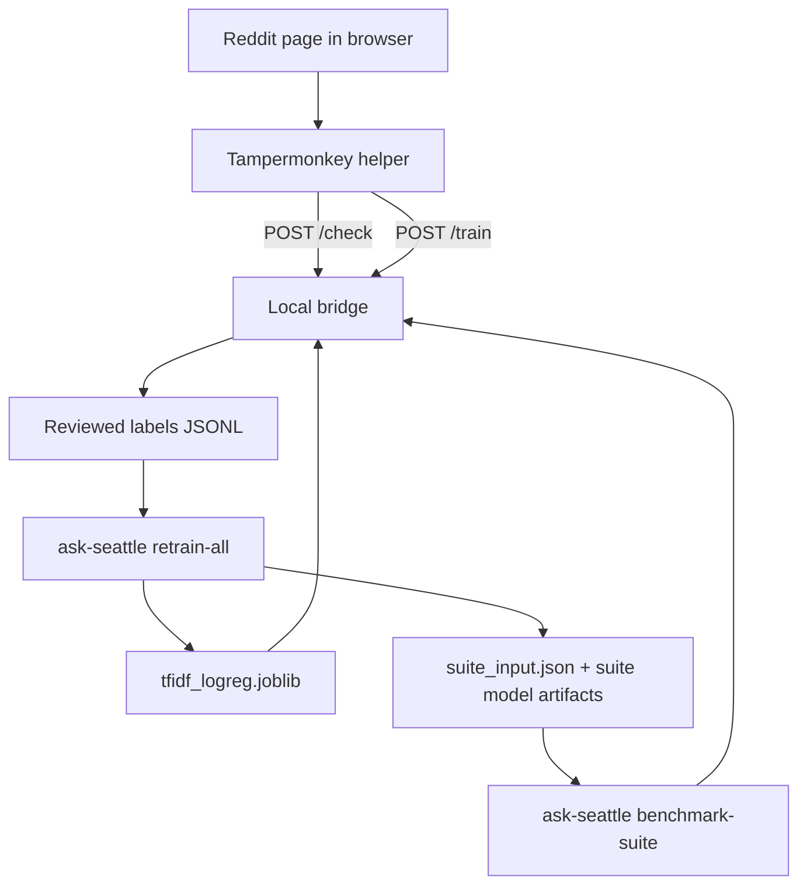

# Architecture

Use this page when you need to understand the current system boundary, data flow, and module layout.

## System Boundary

The project is deliberately small.

Inside scope:

- browser-captured post text
- local reviewed-label storage
- local model training
- local `/check` inference through a localhost bridge
- local multi-model benchmark comparison
- optional remote execution of the existing train and benchmark targets on contributor-managed hardware

Outside scope:

- Reddit API reads
- Reddit API writes
- moderation actions
- hosted model services

The public GitHub repository is code and docs only. Reviewed labels and any other training corpus material stay local to each contributor and may be synced to remote execution hosts per run, but they are not repository content.

## End-To-End Flow

## Main Components

### Browser helper

File:

- `userscripts/ask-seattle-reddit-helper.user.js`

Responsibilities:

- scrape the visible title and body from Reddit pages
- call the bridge for `/check`, `/train`, and `/recorded`
- maintain a browser-side queue for sequential review
- display the current verdict and saved-label status

### Local bridge

File:

- `src/ask_seattle/local_bridge.py`

Responsibilities:

- load the current model bundle
- optionally load comparison bundles from the benchmark-suite summary
- optionally load the trained stacked transformer decider from the benchmark-suite summary
- expose localhost-only HTTP endpoints
- classify posts
- return the stacked transformer decider as the default `/check` verdict when that artifact exists
- optionally route hard cases through a bridge-side hybrid consensus decider
- append reviewed labels
- optionally auto-retrain and hot-reload the model

### Data preparation

File:

- `src/ask_seattle/data.py`

Responsibilities:

- normalize review labels
- normalize body text
- derive exact text hashes
- dedupe reviewed records by identity and text hash
- derive `time_key` and `time_source`

### Model logic

File:

- `src/ask_seattle/model.py`

Responsibilities:

- define the TF-IDF + logistic regression pipeline
- define the shared runtime interfaces used by TF-IDF and comparison-model bundles
- build deterministic train/calibration/test splits
- calibrate probabilities
- select low and high thresholds
- classify posts from a loaded bundle

### Training orchestration

File:

- `src/ask_seattle/training.py`

Responsibilities:

- prepare reviewed labels for training
- fit the operational TF-IDF model and calibrator
- retrain the full five-model artifact-backed suite without held-out benchmarking
- evaluate held-out slices later from the trained suite artifacts
- write `tfidf_logreg.joblib`
- write `training_summary.json`
- build one persisted benchmark-suite split manifest
- train the stacked transformer decider from the calibrated transformer component bundles plus shared post-shape features
- benchmark the five artifact-backed suite models plus the derived hybrid-policy row against that shared manifest

### CLI

File:

- `src/ask_seattle/cli.py`

Responsibilities:

- expose `train`, `retrain-all`, `check`, `benchmark-variants`, `benchmark-suite`, and `serve-bridge`

## Design Choices

### Browser-originated training data only

The bridge accepts title and body text that is already visible in the browser. This avoids server-side Reddit fetching and keeps the supported workflow narrow and auditable.

### One cheap operational retrain path

The operational retrain path is TF-IDF + logistic regression because it is fast, easy to inspect, cheap to retrain, and strong enough for repeated wording patterns.

That does not mean the repository only supports one model family. The benchmark suite now compares five local model paths on the same split so the project can make evidence-based promotion decisions without turning every retrain into a heavyweight transformer job.

The bridge now promotes one of those benchmarked artifacts into the deployed `/check` path: a stacked transformer decider trained from the three transformer comparison models. TF-IDF remains the cheap retrain path, the browser-visible fallback, and the audit baseline in `decision_context.primary_result`.

The optional `hybrid_consensus` policy still exists, but it is now an alternate routed bridge-layer decision policy rather than the default deployed verdict.

### One shared benchmark manifest

The benchmark suite writes a shared `suite_input.json` manifest and requires every model family to consume it.

That keeps the comparison honest:

- same prepared rows
- same train/calibration/test membership
- same evaluation subreddit restriction
- same calibration and threshold-selection contract

Without that, model-to-model comparisons would drift into "different task, different numbers" instead of a real benchmark.

### Precision-first thresholds

The training loop chooses thresholds to preserve a high-confidence band with a strict precision target. That is more aligned with moderation use than a single raw probability cut.

### Shared deterministic splits

Training uses one deterministic split object and reuses it across all evaluators. The default is a seeded random split because the reviewed corpus is typically a short rolling window, and that keeps the benchmark from overfitting to when posts happened to be labeled.

Time-based splitting is still available as an explicit option when the collection horizon is long enough that future-facing drift is the thing you want to measure.

## Runtime Invariants

The current implementation should continue to satisfy these:

- no Reddit API calls
- no moderation actions
- no server-side scraping
- browser-originated input only
- local filesystem artifacts only
- binary labels only
- the operational retrain path remains local TF-IDF
- the benchmark suite remains local-first and runnable on the MacBook Pro M2 32 GB, even if some model families are slow

If you change one of those, update the architecture docs, README, and public references together.

Next:

- [Development workflow](development.md)
- [Bridge API reference](reference/bridge-api.md)
- [Model and thresholds](explanation/model-and-thresholds.md)
