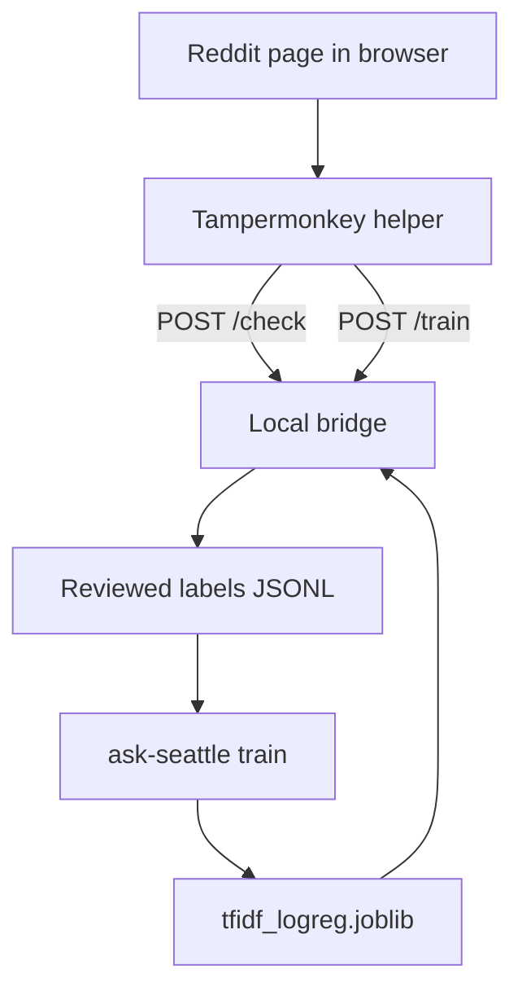

# Architecture

Use this page when you need to understand the current system boundary, data flow, and module layout.

## System Boundary

The project is deliberately small.

Inside scope:

- browser-captured post text
- local reviewed-label storage
- local model training
- local `/check` inference through a localhost bridge

Outside scope:

- Reddit API reads
- Reddit API writes
- moderation actions
- hosted model services

## End-To-End Flow

## Main Components

### Browser helper

File:

- `userscripts/ask-seattle-reddit-helper.user.js`

Responsibilities:

- scrape the visible title and body from Reddit pages
- call the bridge for `/check`, `/train`, and `/recorded`
- maintain a browser-side queue for sequential review
- display the current verdict and saved-label status

### Local bridge

File:

- `src/ask_seattle/local_bridge.py`

Responsibilities:

- load the current model bundle
- expose localhost-only HTTP endpoints
- classify posts
- append reviewed labels
- optionally auto-retrain and hot-reload the model

### Data preparation

File:

- `src/ask_seattle/data.py`

Responsibilities:

- normalize review labels
- normalize body text
- derive exact text hashes
- dedupe reviewed records by identity and text hash
- derive `time_key` and `time_source`

### Model logic

File:

- `src/ask_seattle/model.py`

Responsibilities:

- define the TF-IDF + logistic regression pipeline
- build deterministic train/calibration/test splits
- calibrate probabilities
- select low and high thresholds
- classify posts from a loaded bundle

### Training orchestration

File:

- `src/ask_seattle/training.py`

Responsibilities:

- prepare reviewed labels for training
- fit the model and calibrator
- evaluate the held-out test slice
- write `tfidf_logreg.joblib`
- write `training_summary.json`

### CLI

File:

- `src/ask_seattle/cli.py`

Responsibilities:

- expose `train`, `check`, and `serve-bridge`

## Design Choices

### Browser-originated training data only

The bridge accepts title and body text that is already visible in the browser. This avoids server-side Reddit fetching and keeps the supported workflow narrow and auditable.

### One cheap local model path

The model is TF-IDF + logistic regression because it is fast, easy to inspect, cheap to retrain, and strong enough for repeated wording patterns.

### Precision-first thresholds

The training loop chooses thresholds to preserve a high-confidence band with a strict precision target. That is more aligned with moderation use than a single raw probability cut.

### Shared deterministic splits

Training uses one deterministic split object and reuses it across all evaluators. The default is a seeded random split because the reviewed corpus is typically a short rolling window, and that keeps the benchmark from overfitting to when posts happened to be labeled.

Time-based splitting is still available as an explicit option when the collection horizon is long enough that future-facing drift is the thing you want to measure.

## Runtime Invariants

The current implementation should continue to satisfy these:

- no Reddit API calls
- no moderation actions
- no server-side scraping
- browser-originated input only
- local filesystem artifacts only
- binary labels only

If you change one of those, update the architecture docs, README, and public references together.

Next:

- [Development workflow](development.md)
- [Bridge API reference](reference/bridge-api.md)
- [Model and thresholds](explanation/model-and-thresholds.md)
